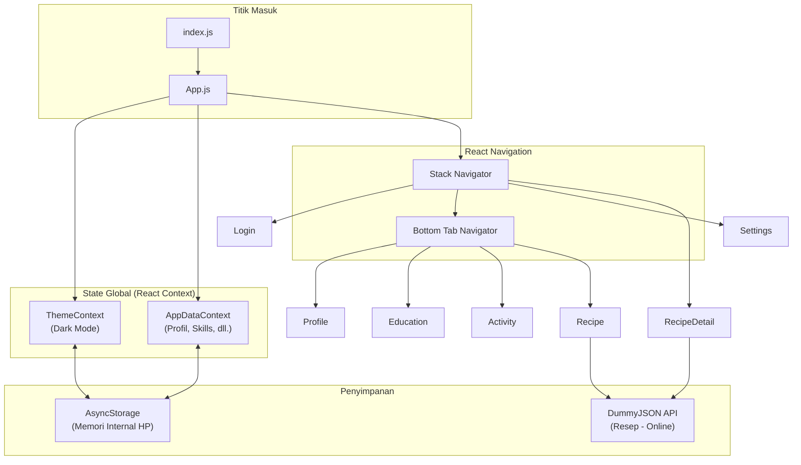
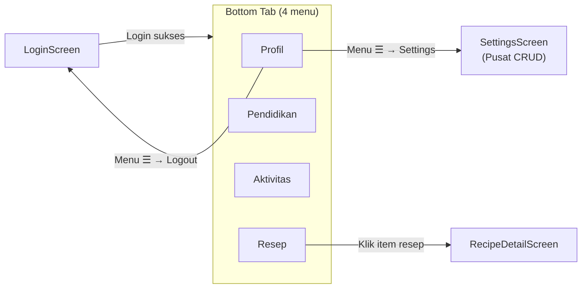

# MyPortfolio

Aplikasi mobile **CV Digital / Portofolio Pribadi** berbasis **React Native** dan **Expo**. Proyek ini dibuat sebagai tugas akhir mata kuliah **Pemrograman Mobile** di **Universitas Yatsi Madani (UYM)**.

Aplikasi menampilkan biodata, riwayat pendidikan, aktivitas harian, dan daftar resep kuliner — dengan semua data profil disimpan secara **offline** di perangkat pengguna.

---

## Daftar Isi

1. [Ringkasan Proyek](#ringkasan-proyek)
2. [Teknologi & Platform](#teknologi--platform)
3. [Arsitektur Aplikasi](#arsitektur-aplikasi)
4. [Alur Navigasi](#alur-navigasi)
5. [Fitur & Menu](#fitur--menu)
6. [Penyimpanan Data](#penyimpanan-data)
7. [Struktur Folder & File](#struktur-folder--file)
8. [Penjelasan Kode Penting](#penjelasan-kode-penting)
9. [Library yang Digunakan](#library-yang-digunakan)
10. [Komponen dari React Native](#komponen-dari-react-native)
11. [Instalasi](#instalasi)
12. [Menjalankan Aplikasi (Development)](#menjalankan-aplikasi-development)
13. [Build APK / AAB](#build-apk--aab)
14. [Kredensial Login Demo](#kredensial-login-demo)
15. [Catatan untuk Presentasi](#catatan-untuk-presentasi)

---

## Ringkasan Proyek

| Item | Keterangan |
|------|------------|
| **Nama Aplikasi** | MyPortfolio |
| **Versi** | 1.0.0 |
| **Package Android** | `com.mznf.myportfolio` |
| **Expo SDK** | 54.0.0 |
| **React Native** | 0.81.5 |
| **Bahasa** | TypeScript + JavaScript |
| **Platform** | Android, iOS, Web |
| **Akun Expo** | [@zakyxxxx/MyPortfolio](https://expo.dev/accounts/zakyxxxx/projects/MyPortfolio) |

### Konsep Utama

- **Halaman utama bersih (Read Only):** Profil, Pendidikan, dan Aktivitas hanya menampilkan data — tidak ada form edit di sana.
- **Pusat CRUD terpusat:** Semua pengeditan data dilakukan di halaman **Settings**.
- **Data persisten:** Data tersimpan di memori internal perangkat menggunakan `AsyncStorage`, sehingga tidak hilang saat aplikasi ditutup.
- **Dark Mode:** Tema gelap/terang bisa diaktifkan dan disimpan secara lokal.
- **Integrasi API:** Halaman Resep mengambil data dari API publik [DummyJSON](https://dummyjson.com/docs/recipes).

---

## Teknologi & Platform

### Stack Teknologi

```
React 19  →  React Native 0.81  →  Expo SDK 54  →  Android / iOS / Web
```

| Lapisan | Teknologi | Fungsi |
|---------|-----------|--------|
| **Framework UI** | React Native | Membangun antarmuka mobile dengan komponen seperti di web, tetapi di-render ke komponen native Android/iOS |
| **Runtime & Tooling** | Expo | Mempermudah development, build, dan akses fitur native (kamera, splash screen, dll.) tanpa konfigurasi native yang rumit |
| **Bahasa** | TypeScript | JavaScript dengan tipe data — mengurangi bug dan memudahkan maintenance |
| **UI Library** | React Native Paper | Komponen Material Design (Button, Card, TextInput, Chip, dll.) |
| **Navigasi** | React Navigation v6 | Mengatur perpindahan antar halaman (Stack + Bottom Tab) |
| **HTTP Client** | Axios | Mengambil data resep dari API eksternal |
| **Penyimpanan Lokal** | AsyncStorage | Menyimpan data JSON di memori internal perangkat |
| **Build & Deploy** | EAS Build | Membangun file APK/AAB di cloud Expo |

### Mengapa Expo?

Expo adalah "lapisan" di atas React Native yang menyediakan:

- **Expo Go** — aplikasi bisa diuji langsung di HP tanpa build APK dulu (scan QR code).
- **EAS Build** — membangun APK/AAB di server cloud tanpa harus install Android Studio secara penuh.
- **Plugin native** — splash screen, image picker, font, dll. dikonfigurasi lewat `app.json`.

### Platform yang Didukung

| Platform | Status | Keterangan |
|----------|--------|------------|
| **Android** | ✅ Utama | Target build APK untuk instalasi langsung |
| **iOS** | ✅ Didukung | Perlu Mac + Xcode untuk build native |
| **Web** | ✅ Didukung | Bisa dijalankan di browser via `expo start --web` |

---

## Arsitektur Aplikasi



### Pola Arsitektur

1. **Context API** — state global (tema & data aplikasi) dibagikan ke seluruh komponen tanpa prop drilling.
2. **Separation of Concerns** — logic penyimpanan di `storage.ts`, validasi di `constants/auth.ts`, UI di `screens/`.
3. **Read/Write terpisah** — halaman tampilan (read) dan halaman edit (write/CRUD) dipisahkan secara jelas.

---

## Alur Navigasi



### Jenis Navigator

| Navigator | File | Fungsi |
|-----------|------|--------|
| **Stack Navigator** | `App.js` | Halaman bertingkat: Login → Main → Settings / RecipeDetail. Mendukung tombol "Kembali". |
| **Bottom Tab Navigator** | `App.js` | 4 tab di bawah layar: Profil, Pendidikan, Aktivitas, Resep. |

---

## Fitur & Menu

### F1 — Login (`LoginScreen.tsx`)

- Validasi **username** harus berupa NIM mahasiswa.
- Validasi **password** dengan aturan keamanan profesional:
  - Minimal 8 karakter
  - Huruf kapital (A-Z)
  - Huruf kecil (a-z)
  - Angka (0-9)
  - Simbol khusus (!@#$...)
- Feedback visual real-time (ikon centang/silang, warna hijau/merah).
- Toggle Dark Mode di pojok kanan atas.
- Background motif batik dari asset `BG_SplashScreen.png`.

### F2 — Profil (`ProfileScreen.tsx`) — Read Only

- Foto profil (default logo / custom dari galeri).
- Data pribadi: nama, email (bisa diklik → buka mail), alamat.
- Tentang saya (bio).
- Daftar keahlian (skills) dalam bentuk Chip.
- Sosial media: WhatsApp, Instagram, LinkedIn, GitHub.
  - **Tekan** → buka link.
  - **Tekan lama** → salin link ke clipboard.
- Switch Dark Mode + menu hamburger (Settings, Logout).

### F3 — Pendidikan (`EducationScreen.tsx`) — Read Only

- Timeline vertikal: SD → SMP → SMA → Kuliah UYM.
- Data bersumber dari Settings.

### F4 — Aktivitas Harian (`ActivityScreen.tsx`) — Read Only

- Accordion per hari (Senin–Minggu).
- Menampilkan daftar aktivitas per hari.
- Data dikelola dari Settings.

### F5 — Resep (`RecipeScreen.tsx`) — Read Only + API

- Grid 2 kolom menampilkan resep dari API DummyJSON.
- Filter berdasarkan **tag** (chip horizontal di atas daftar).
- Pull-to-refresh untuk memuat ulang data.
- Klik item → navigasi ke halaman detail.

### F6 — Detail Resep (`RecipeDetailScreen.tsx`)

- Gambar, nama, cuisine, waktu masak, rating.
- Daftar bahan (ingredients).
- Langkah-langkah memasak (instructions) bernomor.

### F7 — Settings (`SettingsScreen.tsx`) — Pusat CRUD

| Bagian | Operasi |
|--------|---------|
| Biodata | Edit nama, email, alamat, bio, URL foto, link sosial media |
| Skills | Tambah / hapus keahlian |
| Pendidikan | Edit nama sekolah, tahun, lokasi per jenjang |
| Aktivitas | Tambah / hapus aktivitas per hari |
| **Simpan** | Tombol "SIMPAN SEMUA PERUBAHAN" → persist ke AsyncStorage |

---

## Penyimpanan Data

### AsyncStorage — Data Lokal (Offline)

`AsyncStorage` adalah API penyimpanan key-value sederhana di React Native. Data disimpan sebagai **string JSON** di memori internal perangkat (bukan database relasional).

| Key | Isi | File |
|-----|-----|------|
| `@myportfolio_app_data` | Profil, skills, pendidikan, aktivitas | `src/storage.ts` |
| `@myportfolio_dark_mode` | Preferensi dark mode (`"true"` / `"false"`) | `src/context/ThemeContext.tsx` |

### Struktur Data (`AppData`)

```typescript
{
  profile: {
    name, email, address, about, photo,
    whatsapp, instagram, linkedin, github
  },
  skills: string[],           // contoh: ["React Native", "TypeScript"]
  education: EducationItem[], // 4 item: SD, SMP, SMA, S1
  activities: ActivityItem[]  // { id, day, task }
}
```

### Alur Penyimpanan

```
App dibuka
  → AppDataContext memanggil loadAppData()
  → Baca AsyncStorage
  → Jika kosong → gunakan data default
  → Jika ada → parse JSON + migrasi data lama

User edit di Settings → klik Simpan
  → saveAppData() → AsyncStorage.setItem()

Setiap perubahan state (setelah init)
  → AppDataContext otomatis sync ke AsyncStorage
```

### API Eksternal — Data Online

| Endpoint | Digunakan di | Keterangan |
|----------|--------------|------------|
| `GET https://dummyjson.com/recipes` | `RecipeScreen` | Daftar semua resep |
| `GET https://dummyjson.com/recipes/{id}` | `RecipeDetailScreen` | Detail satu resep |

> Resep **tidak** disimpan di AsyncStorage — selalu di-fetch dari internet saat dibuka.

---

## Struktur Folder & File

```
MyPortfolio/
├── App.js                    # Root component: navigasi & provider
├── index.js                  # Entry point Expo (registerRootComponent)
├── app.json                  # Konfigurasi Expo (nama, icon, splash, Android package)
├── eas.json                  # Konfigurasi EAS Build (profil APK/AAB)
├── package.json              # Dependensi npm & scripts
├── tsconfig.json             # Konfigurasi TypeScript
├── babel.config.js           # Konfigurasi Babel (transpile JS/TS)
├── PRD.md                    # Product Requirement Document
│
├── assets/
│   ├── MYP.png               # Logo aplikasi & icon
│   └── BG_SplashScreen.png   # Background splash & login
│
└── src/
    ├── components/
    │   ├── ScreenHeader.tsx   # Header biru custom (judul + slot kiri/kanan)
    │   └── ScreenLayout.tsx   # Layout standar: header + konten scrollable
    │
    ├── constants/
    │   ├── auth.ts            # Kredensial login & aturan validasi password
    │   └── days.ts            # Daftar hari Senin–Minggu
    │
    ├── context/
    │   ├── AppDataContext.tsx # State global data aplikasi + auto-save
    │   └── ThemeContext.tsx   # State global dark mode
    │
    ├── screens/
    │   ├── LoginScreen.tsx
    │   ├── ProfileScreen.tsx
    │   ├── EducationScreen.tsx
    │   ├── ActivityScreen.tsx
    │   ├── RecipeScreen.tsx
    │   ├── RecipeDetailScreen.tsx
    │   └── SettingsScreen.tsx
    │
    ├── types/
    │   └── recipe.ts          # TypeScript types untuk data resep API
    │
    ├── utils/
    │   └── validation.ts      # Helper validasi NIM & password
    │
    ├── navigation.ts          # Type definitions untuk React Navigation
    ├── storage.ts             # Logic load/save AsyncStorage + data default
    └── theme.ts               # Warna, tema Paper (light/dark)
```

---

## Penjelasan Kode Penting

### `index.js` — Titik Masuk Aplikasi

```javascript
import { registerRootComponent } from 'expo';
import App from './App';
registerRootComponent(App);
```

Expo memanggil `registerRootComponent` untuk mendaftarkan komponen root. Ini menghubungkan kode JavaScript ke shell native Android/iOS.

---

### `App.js` — Pohon Komponen & Navigasi

Urutan provider dari luar ke dalam:

```
SafeAreaProvider          → menghindari notch/status bar
  └── ThemeProvider       → dark mode
        └── PaperProvider → tema Material Design
              └── AppDataProvider → data aplikasi
                    └── NavigationContainer → routing halaman
```

**`createNativeStackNavigator`** — halaman stack (Login, MainTabs, Settings, RecipeDetail).

**`createBottomTabNavigator`** — 4 tab bawah dengan ikon Ionicons.

---

### `src/storage.ts` — Penyimpanan & Data Default

| Fungsi | Deskripsi |
|--------|-----------|
| `loadAppData()` | Membaca JSON dari AsyncStorage, merge dengan default, jalankan migrasi |
| `saveAppData(data)` | Menyimpan objek `AppData` sebagai string JSON |
| `migrateEducation()` | Memperbaiki data pendidikan lama (format SMP/SMA gabung) |
| `migrateActivities()` | Memastikan setiap aktivitas punya field `day` |

---

### `src/context/AppDataContext.tsx` — State Global Data

| Export | Deskripsi |
|--------|-----------|
| `AppDataProvider` | Provider React Context — load data saat mount, auto-save saat berubah |
| `useAppData()` | Hook untuk akses `data`, `setProfile`, `setSkills`, `saveData`, dll. |

**Cara pakai di screen:**

```typescript
const { data, setProfile, saveData } = useAppData();
const profile = data.profile;
```

---

### `src/context/ThemeContext.tsx` — Dark Mode

| Export | Deskripsi |
|--------|-----------|
| `ThemeProvider` | Load preferensi dark mode dari AsyncStorage saat startup |
| `useThemeMode()` | Hook: `{ isDarkMode, toggleDarkMode, paperTheme }` |

---

### `src/constants/auth.ts` — Autentikasi

| Fungsi | Deskripsi |
|--------|-----------|
| `isUsernameFormatValid()` | Cek apakah input = NIM yang benar |
| `isPasswordFormatValid()` | Cek semua aturan password |
| `isLoginValid()` | Cek username + password + format |

---

### `src/navigation.ts` — Tipe Navigasi

Mendefinisikan TypeScript types untuk parameter navigasi:

```typescript
RootStackParamList = {
  Login: undefined;
  MainTabs: undefined;
  RecipeDetail: { id: number };  // menerima ID resep
  Settings: undefined;
}
```

Membantu autocomplete dan mencegah typo saat `navigation.navigate('RecipeDetail', { id: 5 })`.

---

### `src/theme.ts` — Sistem Warna

| Export | Deskripsi |
|--------|-----------|
| `colors` | Palet warna tetap (primary `#0052cc`, success, error, dll.) |
| `lightTheme` / `darkTheme` | Tema React Native Paper MD3 |
| `getScreenColors(isDark)` | Helper warna dinamis per screen berdasarkan mode |

---

## Library yang Digunakan

### Dependencies Utama

| Package | Versi | Fungsi |
|---------|-------|--------|
| `expo` | ~54.0.0 | Framework & toolchain utama |
| `react` | 19.1.0 | Library UI berbasis komponen |
| `react-native` | 0.81.5 | Bridge ke komponen native mobile |
| `react-native-paper` | ^5.15.3 | Komponen UI Material Design |
| `@react-navigation/native` | ^6.1.7 | Core navigasi antar halaman |
| `@react-navigation/native-stack` | ^6.10.0 | Navigator stack (push/pop) |
| `@react-navigation/bottom-tabs` | ^6.5.16 | Navigator tab bawah |
| `@react-native-async-storage/async-storage` | 2.2.0 | Penyimpanan lokal key-value |
| `axios` | ^1.18.1 | HTTP client untuk API resep |
| `expo-image-picker` | ~17.0.11 | Akses galeri foto (foto profil) |
| `expo-clipboard` | ~8.0.8 | Salin teks ke clipboard |
| `expo-splash-screen` | ~31.0.13 | Splash screen saat app loading |
| `expo-status-bar` | ~3.0.9 | Kontrol warna status bar |
| `expo-font` | ~14.0.12 | Load font (peer dep. vector-icons) |
| `@expo/vector-icons` | ^15.0.3 | Ikon (Ionicons, MaterialIcons, dll.) |
| `react-native-gesture-handler` | ~2.28.0 | Handler gesture (swipe, tap) — wajib untuk navigasi |
| `react-native-safe-area-context` | ~5.6.0 | Menghindari area notch/home indicator |
| `react-native-screens` | ~4.16.0 | Optimasi performa native screen |
| `react-native-web` | ^0.21.0 | Dukungan render di browser |
| `babel-preset-expo` | ~54.0.10 | Preset Babel untuk transpile kode |

### Dev Dependencies

| Package | Fungsi |
|---------|--------|
| `typescript` | Kompiler & type checker |
| `@types/react` | Type definitions untuk React |
| `@types/react-dom` | Type definitions untuk React DOM |

---

## Komponen dari React Native

Berikut komponen **bawaan React Native** (`import from 'react-native'`) yang dipakai di proyek ini dan fungsinya:

| Komponen / API | Dipakai di | Fungsi |
|----------------|------------|--------|
| `View` | Semua screen | Container/layout dasar (seperti `<div>` di web) |
| `Text` | Beberapa screen | Menampilkan teks (via Paper juga) |
| `ScrollView` | Login, Profile, Settings, dll. | Konten yang bisa di-scroll vertikal |
| `FlatList` | RecipeScreen | List performa tinggi untuk data banyak (resep) |
| `StyleSheet` | Semua screen | Membuat style CSS-like untuk komponen |
| `Pressable` | ProfileScreen | Area yang bisa di-tap/tekankan lama |
| `ImageBackground` | LoginScreen | Background gambar di belakang konten |
| `KeyboardAvoidingView` | LoginScreen | Menggeser layout saat keyboard muncul |
| `Platform` | LoginScreen | Deteksi OS (iOS/Android) untuk behavior berbeda |
| `Alert` | Login, Profile, Settings | Dialog popup native (sukses/gagal/konfirmasi) |
| `Linking` | ProfileScreen | Membuka URL eksternal (browser, WhatsApp, email) |
| `Dimensions` | RecipeScreen | Mendapatkan lebar layar untuk kalkulasi grid |
| `ActivityIndicator` | Context, Recipe | Spinner loading native |

### Perbedaan React Native vs Web

| Konsep Web | React Native |
|------------|--------------|
| `<div>` | `<View>` |
| `<span>`, `<p>` | `<Text>` (semua teks **harus** di dalam `<Text>`) |
| CSS file | `StyleSheet.create({})` — inline object |
| `localStorage` | `AsyncStorage` |
| `window.open()` | `Linking.openURL()` |

---

## Instalasi

### Prasyarat

- **Node.js** v18 atau lebih baru — [nodejs.org](https://nodejs.org)
- **npm** (terinstal bersama Node.js)
- **Expo Go** di HP Android/iOS (untuk testing cepat) — [expo.dev/go](https://expo.dev/go)
- **Akun Expo** (gratis) — [expo.dev](https://expo.dev) — diperlukan untuk build APK

### Langkah Instalasi

```bash
# 1. Clone atau download project
cd MyPortfolio

# 2. Install semua dependensi
npm install

# 3. (Opsional) Cek kesehatan project
npx expo-doctor

# 4. (Opsional) Cek tipe TypeScript
npm run typecheck
```

---

## Menjalankan Aplikasi (Development)

### Mode Expo Go (Paling Cepat)

```bash
npm start
# atau
npx expo start
```

1. Scan QR code dengan aplikasi **Expo Go** di HP.
2. Pastikan HP dan komputer dalam **jaringan WiFi yang sama**.

### Per Platform

```bash
npm run android    # Buka di emulator Android / Expo Go
npm run ios        # Buka di simulator iOS (hanya Mac)
npm run web        # Buka di browser
```

### Hot Reload

Saat development, perubahan kode langsung terlihat di HP/emulator tanpa rebuild — ini disebut **Fast Refresh**.

---

## Build APK / AAB

### Persiapan (Sekali Saja)

```bash
# Install EAS CLI global
npm install -g eas-cli

# Login ke akun Expo
eas login

# Hubungkan project ke Expo (sudah dilakukan)
eas init
```

### Build APK (Instal Langsung di HP)

```bash
npm run build:apk
```

- Profil: `preview` di `eas.json`
- Output: file **`.apk`**
- Build berjalan di **cloud Expo** — bisa ditutup terminal, cek progress di [expo.dev](https://expo.dev)

### Build AAB (Upload ke Play Store)

```bash
npm run build:aab
```

- Profil: `production`
- Output: file **`.aab`** (Android App Bundle)

### Cek Status Build

```bash
eas build:list
```

Atau buka dashboard: [expo.dev/accounts/zakyxxxx/projects/MyPortfolio/builds](https://expo.dev/accounts/zakyxxxx/projects/MyPortfolio/builds)

### Catatan Build

| Topik | Penjelasan |
|-------|------------|
| **Antrian gratis** | Akun Expo gratis bisa antre lama (30 menit – beberapa jam) saat server ramai |
| **Tutup terminal aman** | Build tetap jalan di cloud setelah upload selesai |
| **Keystore** | Expo otomatis generate & simpan keystore Android untuk signing APK |
| **Package name** | `com.mznf.myportfolio` — unik di Play Store |

### Build Lokal (Alternatif, Tanpa Antrian Cloud)

Membutuhkan Android SDK + JDK terinstal:

```bash
eas build --platform android --profile preview --local
```

---

## Kredensial Login Demo

| Field | Nilai |
|-------|-------|
| **Username (NIM)** | `23050951` |
| **Password** | `MyP@ssw0rd` |

> Password sudah memenuhi semua aturan keamanan (8+ karakter, huruf besar/kecil, angka, simbol).

Kredensial didefinisikan di `src/constants/auth.ts`.

---

## Catatan untuk Presentasi

### Poin yang Bisa Dijelaskan ke Dosen

1. **Kenapa React Native?** — Satu codebase untuk Android & iOS, development cepat, komunitas besar.
2. **Kenapa Expo?** — Mempercepat development, tidak perlu setup Android Studio untuk testing awal.
3. **Kenapa AsyncStorage?** — Data profil tidak perlu server/backend; aplikasi bisa offline penuh kecuali halaman Resep.
4. **Pemisahan Read/Write** — UX lebih bersih; user tidak bingung mana halaman tampilan vs edit.
5. **Context API** — State management sederhana tanpa Redux (cukup untuk skala project ini).
6. **Validasi Login** — Mensimulasikan standar keamanan password di aplikasi nyata.
7. **Integrasi API** — Halaman Resep menunjukkan kemampuan fetch data dari internet (REST API).
8. **Dark Mode** — Preferensi pengguna disimpan persisten, bukan hanya state sementara.
9. **TypeScript** — Type safety mengurangi bug saat project berkembang.
10. **EAS Build** — Modern workflow untuk distribusi aplikasi mobile tanpa konfigurasi Gradle manual.

### Diagram Alur Data (untuk slide)

```
[User Input Settings]
        ↓
[AppDataContext state]
        ↓
[saveAppData() → AsyncStorage]
        ↓
[Profile / Education / Activity Screen membaca data yang sama]
```

### Skema Warna

| Nama | Hex | Penggunaan |
|------|-----|------------|
| Primary | `#0052cc` | Header, tombol, aksen |
| Background | `#f5f5f5` | Latar belakang light mode |
| Background Dark | `#121212` | Latar belakang dark mode |
| Success | `#16a34a` | Validasi sukses, tombol simpan |
| Error | `#dc2626` | Validasi gagal, logout |

---

## Lisensi

Proyek ini dibuat untuk keperluan akademik (Tugas Akhir Pemrograman Mobile — UYM). Hak cipta milik pengembang.

---

**Dikembangkan oleh:** Muhammad Zainal  
**Institusi:** Universitas Yatsi Madani  
**Mata Kuliah:** Pemrograman Mobile
